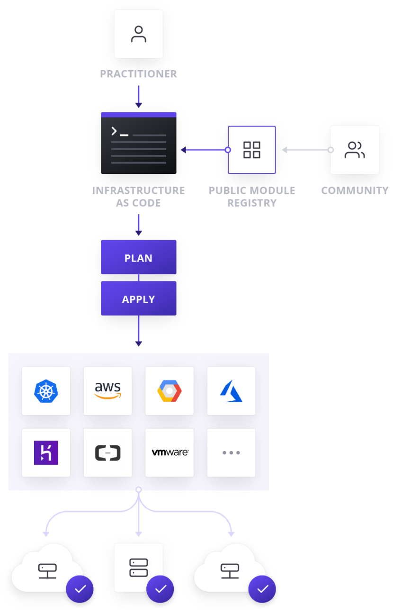

# Introduction to Terraform + Labs
***
In this lab, you will learn how to perform the following tasks:

* Get started with Terraform (GCP).

* Install Terraform from installation binaries.

* Create an organization infrastructure using Terraform. This includes folders, projects, buckets and VM instances.

***
## **1. Motivation : Infrastructure as Code (IaC)**

Terraform is a tool for building, changing, and versioning infrastructure safely and efficiently. <br>
It allows infrastructure to be expressed as code in a simple, human readable language called HCL (HashiCorp Configuration Language). <br>




### Key features
* **Infrastructure as code**
* **Execution plans**
* **Resource graph**
* **Change automation**

***
## **2. Terraform Installation**

- [Official install docs](https://www.terraform.io/downloads.html)
- Download the latest version
```bash
curl -O https://releases.hashicorp.com/terraform/1.0.1/terraform_1.0.1_darwin_amd64.zip
```
- Unzip the archive
```bash
tar zxvf terraform_1.0.1_darwin_amd64.zip
```

- Move the extracted terraform file into your local **bin** folder :
```bash
mv terraform /usr/local/bin/
```
- Confirm the file has been moved and terraform has been successfully installed using the command
```bash
terraform -v
```
***
## **3. Build infrastructure**
After installing Terraform, we can start creating some infrastructure. <br>
We will use **Google Cloud** as a provider. <br> <br>
Before creating the whole infrastructure with folders and projects, we will write our first configuration to launch a single VM instance. 

1. Create an empty configuration file named `instance.tf` 
2. Add the following content in it, replacing `<PROJECT_ID>` with your Google Cloud project ID
``` bash
resource "google_compute_instance" "terraform" {
  project      = "<PROJECT_ID>"
  name         = "terraform-vm"
  machine_type = "n1-standard-1"
  zone         = "europe-west1-b"

  boot_disk {
    initialize_params {
      image = "debian-cloud/debian-9"
    }
  }

  network_interface {
    network = "default"
    access_config {
    }
  }
}
```

**Few notes ...**
* A `resource` might be a physical component such as an VM instance.
* The resource has : a **type** and  a **name**
* `google_compute_instance` is the resource type here

### Terraform Lifecycle
<br>


<br>

``` bash
terraform init
```

This command will automatically download and install any provider binary for the providers to use.
It's the first command to run for a new configuration.

``` bash
terraform plan
```
This command determines what actions are necessary to achieve the desired state specified in the configuration files.
<br>
We can save the generated plan to a file with the optional argument `-out`

``` bash
terraform apply
```

This command performs exactly the steps specified in the plan. <br>

``` bash
terraform destroy
```

Use the destroy command to conveniently clean up all of those temporary objects once you are finished with your work.